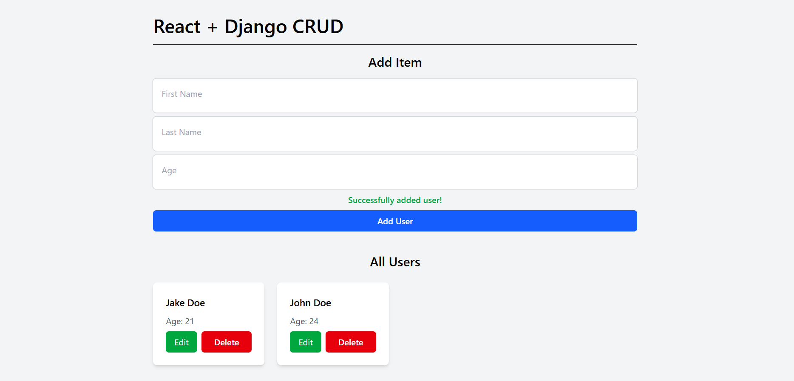

# React + Django CRUD
A simple CRUD application demonstrating how to connect a React frontend with a Django REST Framework backend.

## Tech Stack used:
- **Frontend:** Vite React + Tailwind CSS
- **Backend:** Django + ORM + REST Framework
- **Database:** SQLite

## Preview


## Setup
1. Clone this repository via `git clone https://github.com/khianvictorycalderon/React-Django-CRUD.git`
2. Then create 2 separate terminal for both `frontend` and `backend` folder.

---

## Backend Setup (Inside the backend folder)
1. Generate a safe key using this command in your python interpreter or cmd:
    ```python
    from django.core.management.utils import get_random_secret_key
    print(get_random_secret_key())
    ```
2. Create an `.env` file that contains (paste the generated key in `DJANGO_SECRET_KEY`):
    ```env
    DJANGO_ENV=development
    DJANGO_SECRET_KEY=your-key-here
    DEBUG=True
    ALLOWED_HOSTS=127.0.0.1 localhost https://apixer.vercel.app
    CORS_ALLOWED_ORIGINS=http://127.0.0.1:8001 http://localhost:8001 https://apixer.vercel.app
    CSRF_TRUSTED_ORIGINS=http://127.0.0.1:8001 http://localhost:8001 https://apixer.vercel.app
    ```
    Change the allowed and trusted credentials depending on where you want your project to be tested.
3. Run the following command for database migration:
    - `python manage.py makemigrations` or `py manage.py makemigrations`
    - `python manage.py migrate` or `py manage.py migrate`
4. To run the server, run `py manage.py runserver` or `python manage.py runserver`
    NOTE: If you encounter `Error: You don't have permission to access that port.`, just use a different port, for example:
    - `py manage.py runserver 8001`
    - `python manage.py runserver 8002`
    8001 and 8002 are the port.
5. To create another app, just run `python manage.py startapp <app-name>` or `py manage.py startapp <app-name>`, example: `py manage.py startapp myapp`

## Backend Admin
1. To access the database using admin panel type in the url: "/admin"
2. Run `py manage.py createsuperuser` then enter the email, username, and password you want to use
3. You can edit your database now by logging in your account

---

## Frontend Setup (Inside the frontend folder)
1. Run `npm install`
2. Create an `.env` file that contains:
  ```env
  API_URL=<your-api-here>
  ```
  Then change the `API_URL` depending on where you run the backend.
3. Run `npm run dev`
4. Test all the CRUD features!

---

## Frontend Prerequisites:
Install the following first if you haven't installed it yet:
- NodeJS
- `npm`
- `npm install tailwindcss @tailwindcss/vite`
- `npm install axios`

## Backend Prerequisites:
Install the following first (globally) if you haven't installed it yet:
- `pip install django`
- `pip install djangorestframework`
- `pip install django-cors-headers`